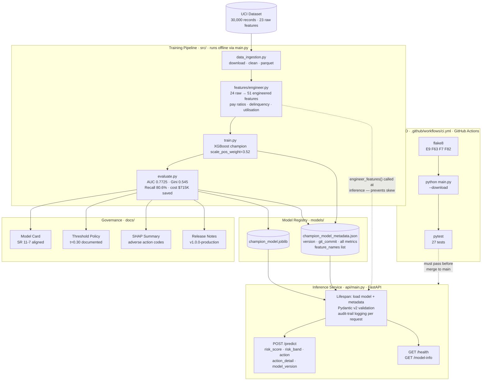

# System Architecture

## Design Principle

The training pipeline and the inference service are **fully decoupled**. The model artifact in `models/` is the only hand-off point between them. Updating or retraining the model never requires changing `api/main.py`, and the API can be deployed independently of the training infrastructure.

---

## Component Diagram

---

## Component Responsibilities

### Training Pipeline (`src/`)

| File | Responsibility |
|------|---------------|
| `data_ingestion.py` | Downloads UCI XLS from source, cleans EDUCATION/MARRIAGE codes, saves to parquet |
| `features/engineer.py` | Transforms 24 raw columns into 51 model-ready features; **called identically at training and inference** |
| `train.py` | Orchestrates the full pipeline: load → engineer → split → fit → evaluate → save artifacts |
| `evaluate.py` | Computes AUC, Gini, business cost, and risk band summaries; writes to metadata JSON |

**Entry point:** `python main.py --download` triggers `run_training_pipeline()` in `src/train.py`.

### Model Registry (`models/`)

| Artifact | Contents |
|----------|---------|
| `champion_model.joblib` | Serialised `XGBClassifier` (300 trees, depth 6) |
| `champion_xgb_YYYYMMDD.joblib` | Dated backup of the same model |
| `champion_model_metadata.json` | Git commit, training date, all evaluation metrics, `feature_names` list (51 items) |

The `feature_names` list in metadata is the contract between the training pipeline and the inference service. The API loads it at startup and selects features in that exact order before calling `model.predict_proba()`.

### Inference Service (`api/main.py`)

- **Startup (lifespan):** loads model + metadata once; stores in module-level `_state` dict
- **`POST /predict`:** validates input (Pydantic v2), calls `engineer_features()`, selects `feature_names` columns in order, runs `predict_proba`, maps probability → band + action
- **`GET /health`:** returns `{"status": "healthy", "model_loaded": true, "model_version": "..."}`
- **`GET /model-info`:** returns full training provenance from metadata JSON — zero hardcoded values

### CI/CD (`.github/workflows/ci.yml`)

Three-step quality gate on every push to `main`:

1. **`flake8`** — catches runtime-breaking errors only (undefined names, syntax errors); excludes `.venv/` and `notebooks/`
2. **`python main.py --download`** — runs the full training pipeline in CI, proving end-to-end reproducibility
3. **`pytest tests/ -v`** — 27 tests covering health, model-info, valid predictions, and 12 validation rejection cases

---

## Key Design Decisions

### 1. Training/serving feature parity

`engineer_features()` in `src/features/engineer.py` is called in two places:
- `src/train.py` — during training
- `api/main.py` — at inference time, via `_run_model()`

This means any change to the feature engineering function automatically affects both sides — there is no separate "preprocessing" step in the API that could silently diverge from training.

The `feature_names` list in `metadata.json` provides an additional guard: the API selects columns in training order, so even if `engineer_features()` output changes column order in future, the model will still receive the right inputs.

### 2. Model registry as decoupling boundary

The API reads the model from `models/champion_model.joblib` at startup. It does not import anything from `src/train.py`. This means:
- The model can be retrained and the file replaced without redeploying the API
- The API can be updated (new endpoints, logging changes) without touching the training code
- Docker and Render deployments use the same API code whether the model was trained locally or in CI

### 3. Threshold externalised in metadata

The operational threshold `t=0.30` is stored in `champion_model_metadata.json` and read by the API at startup into `_THRESHOLD`. Changing the threshold is a metadata update + service restart — no code change required.

### 4. Audit trail by design

Every `/predict` call logs a `request_id`, the key input features, the model score, the risk band, the action, the model version, and the threshold used. In a regulated environment (SR 11-7), every credit decision must be traceable. The log structure makes it straightforward to ingest into a SIEM or decision database.

---

## Design Rationale

**Modular architecture:** The training pipeline and inference service share only one interface — the model artifact in `models/`. This means the XGBoost model can be retrained or replaced without changing a single line of API code.

**Training/serving feature parity:** One of the most common production bugs in ML is training/serving skew. Calling the same `engineer_features()` function in both `src/train.py` and `api/main.py` eliminates any possibility of a separate preprocessing step silently diverging.

**CI runs the full pipeline:** The GitHub Actions pipeline doesn't just run unit tests — it runs the full training pipeline from a cold start. If the data download breaks, feature engineering changes unexpectedly, or a dependency update breaks the model, CI catches it before code reaches production.

**Metadata as provenance record:** `champion_model_metadata.json` stores the git commit hash, training date, all evaluation metrics, and the exact feature column order. The API reads this at startup and exposes it via `/model-info`, so any downstream consumer can verify which model version is live.
